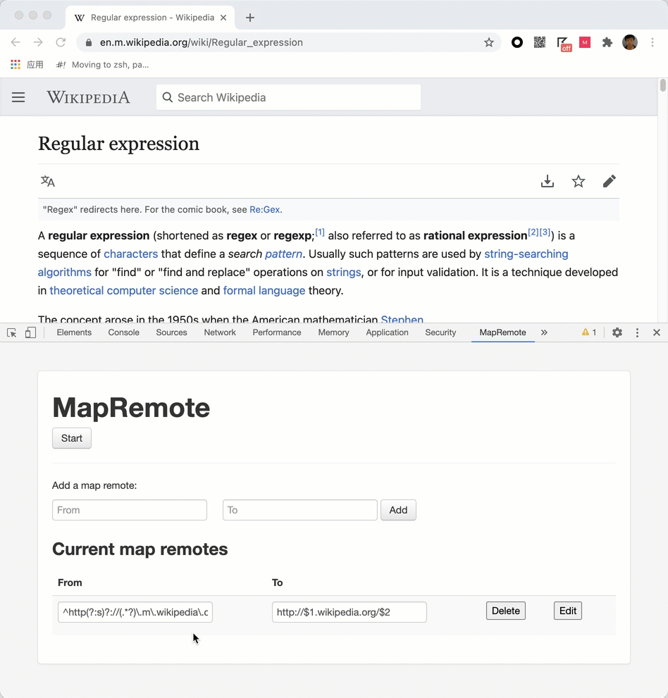

# chrome-map-remote
Chrome devtools extension of map remote like charles.

- Open devtools, navigate to "Map Remote" tab 
- Click "Add" button to add from and to.
- Click "Start" button to start modifying response.
- You must keep this devtools open

## examples

From: ^http(?:s)?://(.*?)\.m\.wikipedia\.org/(.*)
To: http://$1.wikipedia.org/$2
Effect: always show the desktop site of wikipedia:

http://en.m.wikipedia.org/wiki/Regular_expression -> http://en.wikipedia.org/wiki/Regular_expression 

